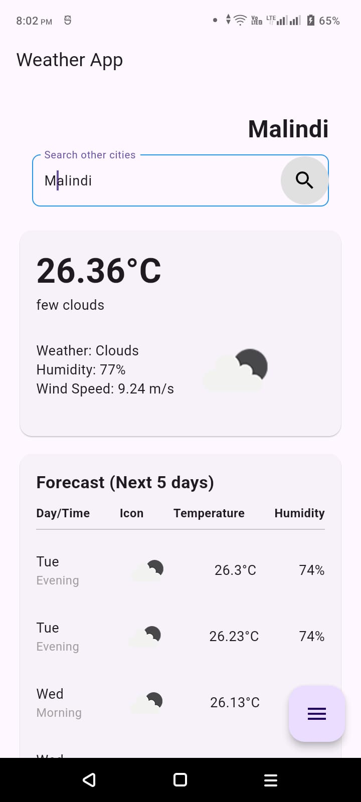
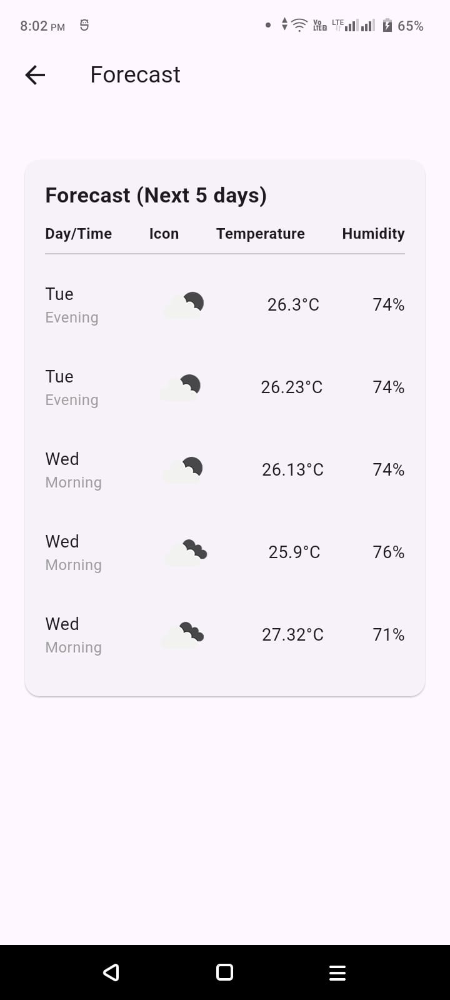
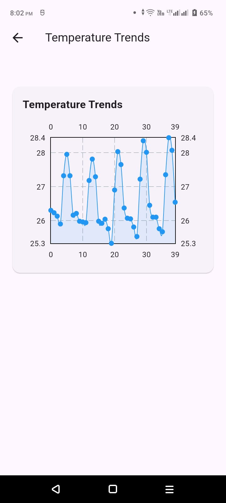

# Weather App (Task) Documentation

This documentation will guide you through setting up, running, and understanding the Weather App built using Flutter.

App Screenshots:
  
  
  

Available Scripts:
-------------------
In the project directory, you can run:

### `flutter pub get`

Fetches the necessary dependencies for the project.

### `flutter run`

Runs the app in development mode.
Connect an Android or iOS device/emulator and use this command to view it.

Setting up Flutter on Android Studio:
-------------------------------------
1. Download and install Android Studio from the official website: https://developer.android.com/studio
2. Install the Flutter and Dart plugins for Android Studio:
    - Open Android Studio.
    - Go to Preferences > Plugins.
    - Search for 'Flutter' and install it (this will also install the Dart plugin).
    - Restart Android Studio.

3. Set up the Flutter SDK:
    - Download the Flutter SDK from the official website: https://flutter.dev/docs/get-started/install
    - Extract the downloaded file to the desired location on your machine.
    - Add the Flutter SDK path to your system environment variables.

4. Verify the Flutter installation:
    - Open a terminal and run `flutter doctor` to check if there are any dependencies you need to install.

Cloning and Running the App:
-----------------------------
1. Clone the repository from GitHub:
    - Open a terminal and run:
      ```
      git clone https://github.com/kev254/Weather-App.git
      ```
    - Navigate to the project directory:
      ```
      cd Weather-App
      ```

2. Fetch the project dependencies:
    - Run the following command to install the necessary packages:
      ```
      flutter pub get
      ```

3. Connect a device or start an emulator:
    - Connect your Android or iOS device via USB, or start an Android emulator.

4. Run the app:
    - Use the following command to start the app:
      ```
      flutter run
      ```

APK File:
---------
To test the app on a real device, download the APK file from the following link:
[Download APK File](screenshots/app-release.apk)

Project Dependencies:
----------------------
The project uses the following dependencies:
- provider: ^5.0.0
- http: ^0.13.3
- fl_chart: ^0.36.0

These dependencies are defined in the `pubspec.yaml` file.

App Features:
-------------
The Weather App allows users to:
- Search for weather information by city.
- View current weather conditions including temperature, humidity, and wind speed.
- View a 5-day weather forecast.
- View temperature trends in a line chart.

The app fetches weather data from the OpenWeatherMap API.

Note:
-----
Ensure you have a stable internet connection to fetch real-time weather data from the API.
